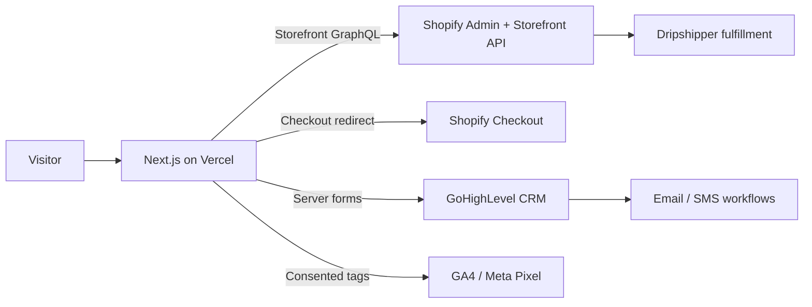

# Wake N Bake Coffee Co. — Headless Storefront

Beach-inspired specialty coffee storefront for Wake N Bake Coffee Co., built as an independent Next.js App Router app on top of Shopify Storefront API (headless). Checkout stays on Shopify. Coffee fulfillment is expected via Dripshipper through Shopify — not a direct frontend integration.

## Architecture



## Stack

- Next.js App Router + TypeScript (strict)
- Tailwind CSS v4 + coastal design tokens
- Shopify Storefront GraphQL API
- Zod validation, Lucide icons
- Vitest unit tests
- Vercel hosting

## Quick start

```bash
cp .env.example .env.local
npm install
npm run dev
```

Without Shopify credentials, the app runs in **demo mode** (typed mock catalog + visible banner). Demo mode never silently pretends to be live Shopify in production (`VERCEL_ENV=production`).

## Scripts

| Command | Purpose |
|---|---|
| `npm run dev` | Local development |
| `npm run build` | Production build |
| `npm run start` | Serve production build |
| `npm run typecheck` | TypeScript |
| `npm run lint` | ESLint |
| `npm test` | Vitest |

## Key paths

- `app/` — routes (shop, PDP, cart, content, legal, API)
- `components/` — layout, commerce, forms, sections, UI
- `lib/shopify/` — Storefront client, queries, cart helpers, demo catalog
- `lib/ghl/` — CRM submission modes (API / webhook / dev log)
- `docs/` — setup guides and launch checklist

## Environment

See `.env.example`. Server secrets (`SHOPIFY_STOREFRONT_ACCESS_TOKEN`, `GHL_API_TOKEN`, etc.) never ship to the browser.

## Documentation

- [Shopify setup](docs/shopify-setup.md)
- [Dripshipper setup](docs/dripshipper-setup.md)
- [GHL setup](docs/ghl-setup.md)
- [GHL automation plan](docs/ghl-automation-plan.md)
- [Vercel deployment](docs/vercel-deployment.md)
- [Content management](docs/content-management.md)
- [Launch checklist](docs/launch-checklist.md)
- [Implementation plan](IMPLEMENTATION_PLAN.md)
- [Build report](BUILD_REPORT.md)

## Brand note

The wordmark/emblem in `components/ui/BrandMark.tsx` is **temporary** until final logo assets arrive.
